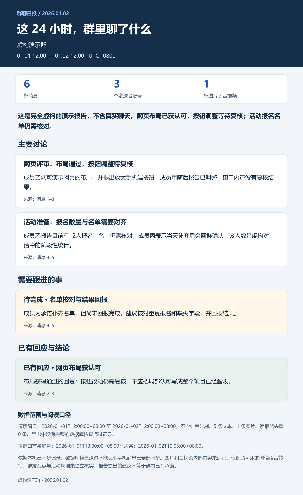
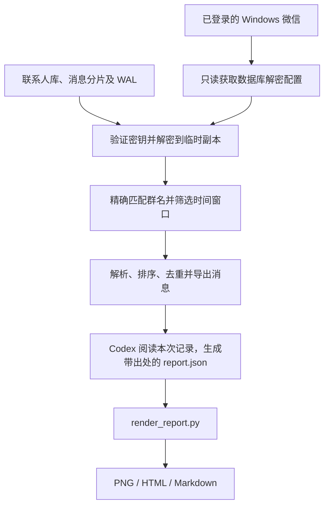

# 晚笺 · 微信晚间复盘（本地扩展版）

基于 Tina2088/wechat-group-report，新增跨群与私聊读取、待办和待回复候选提取、跨天处理状态、本地网页界面、可配置的模型 API 与离线报告。

支持收藏消息并管理标题、标签、备注；按微信身份跨会话搜索发言、@ 与引用，可按时间和关键词筛选。

2026-09-21 更新：同群分段摘要合并为故事线，按群进入主题/结论/待办；个人相关事项与可能相关事项分区。HTML 按需呈现群详情和依据，不再铺开全部历史原文；PNG 和 Markdown 改为精简重点版。

**直接使用：双击 `启动微信复盘.cmd`，打开 http://127.0.0.1:8765 。**

详细说明见 [本地使用说明](本地使用说明.md)，实际验证情况见 [验证记录](验证记录.md)。在本地页面填写模型配置后启用 AI；未配置时使用明确标注的本地规则筛查。项目没有默认启用定时任务或自动发送消息。

下文保留上游原始 Skill 的说明，适用于 `scripts/read_group.py` 与 `scripts/render_report.py` 的单群工作流；本地扩展入口为 `app.py`。

---

## 上游原始项目 · WeChat Group Report

一个可复用的 Codex Skill：读取 Windows 微信中指定群的本地已同步记录，整理主要话题、结论和待办，一次生成 **PNG 长图、HTML 网页和 Markdown 摘要**。

```text
使用 $wechat-group-report，读取“我的项目群”最近48小时记录，
生成 PNG 和网页版总结报告。
```

上游原始 Skill 是由 Codex 会话协调的工作流：Python 读取与渲染，Codex 理解并总结消息。下文所述原始脚本不内置模型 API；本地扩展版已添加可配置模型接口。

## 示例效果

下图及 `examples/synthetic/` 中所有消息均为**完全虚构的演示数据**，不来自任何真实微信群。



同一份内容还会生成 [离线网页示例](examples/synthetic/index.html) 和 [Markdown 示例](examples/synthetic/summary.md)。下载 HTML 后可直接在浏览器打开。

## 功能

- 按群名精确匹配，默认最近 24 小时，可指定时长、历史截止时间与已确认的群 ID。
- 读取联系人库、消息分片和 WAL 增量；检查结构完整性、时间窗口、发送者映射和重复记录。
- 解析文本、引用和可解析卡片；每个报告条目引用本次真实消息编号。
- 区分已确认、已接收、待完成、个人观点和报告建议。
- PNG 自动计算高度，HTML 响应式排版、无外部资源依赖，两者与 Markdown 使用同一份正文。
- 密钥不主动写入文件，临时解密副本在正常退出时清理，原微信数据库保持只读。

## 环境与兼容性

| 项目 | 范围 |
|---|---|
| 读取系统 | Windows，微信桌面客户端已登录 |
| 实际验证版本 | 微信 4.1.13.65 |
| Python | 在 Python 3.13 上验证；代码使用 Python 3.10+ 语法 |
| 依赖 | cryptography、zstandard、Pillow，版本见 requirements.txt |
| 中文字体 | 默认使用 Windows 微软雅黑，可指定其他字体 |
| macOS | 当前读取器不支持，不能直接照搬 Windows 方案 |

微信更新可能导致内存结构变化，需要重新适配。手机上存在的记录不一定已同步到电脑；数据库检查通过也不能证明同步完整。

## 安装

可以把本仓库交给 Codex 的 `$skill-installer` 安装，也可手动克隆到个人技能目录。官方文档列出的个人目录为 `~/.agents/skills`；不同本地环境的既有技能目录也可能不同，避免安装同名副本。[OpenAI Skills 文档](https://learn.chatgpt.com/docs/build-skills)

Windows PowerShell 手动安装：

```powershell
$skillDir = Join-Path $HOME '.agents\skills\wechat-group-report'
git clone https://github.com/Tina2088/wechat-group-report.git $skillDir
Set-Location -LiteralPath $skillDir
python -m venv .venv
.\.venv\Scripts\python.exe -m pip install -r scripts\requirements.txt
Copy-Item -LiteralPath settings.example.json -Destination settings.local.json
```

编辑 `settings.local.json`，填入本机实际信息：

```json
{
  "db_dir": "C:/Users/YOUR_NAME/Documents/xwechat_files",
  "account": "YOUR_ACCOUNT_DIRECTORY",
  "self_name": "你的显示名",
  "output_root": "D:/wechat-reports",
  "default_group": "我的项目群"
}
```

`db_dir` 是包含账号目录的父目录；`account` 是该目录下、包含 `db_storage` 的账号文件夹名。通过微信的文件存储位置设置核对实际路径，不要复制别人的账号标识。`default_group` 供 Skill 在未提供群名时参考，读取脚本仍要求明确传入 `--group`。

配置后在 Codex 中调用 `$wechat-group-report`。若新技能未显示，重启 Codex；安装和发现机制详见上面的官方文档。Skill 会优先使用自身目录中的 `.venv\Scripts\python.exe`。

## 常用请求

```text
使用 $wechat-group-report，总结“我的项目群”最近24小时，生成 PNG 和网页。

使用 $wechat-group-report，总结“我的项目群”最近48小时，重点列出待回复事项。

使用 $wechat-group-report，总结“我的项目群”截至2026-01-02T12:00:00+08:00
往前24小时的记录。
```

“网页版”默认是本地 HTML。若另需公开分享链接，应明确要求发布，并确认报告内容适合分享；此技能不默认上传原始记录、数据库或个人配置。

## 手动运行与实现流程



1. 读取本机记录：

```powershell
.\.venv\Scripts\python.exe scripts\read_group.py --group '我的项目群' --hours 48
```

2. 读取命令返回的独立输出目录中的 `messages.txt` / `messages.json`，让 Codex 按 [报告结构](references/report-schema.md) 写入 `report.json`。**渲染器不会自行调用模型或生成摘要。**
3. 渲染三种输出：

```powershell
.\.venv\Scripts\python.exe scripts\render_report.py --run-dir 'D:\wechat-reports\本次输出目录'
```

| 读取参数 | 含义 |
|---|---|
| `--group` | 必填的准确群名 |
| `--hours` | 回溯小时数，默认 24 |
| `--end` | 含时区的 ISO 8601 截止时间 |
| `--group-id` | 核实同名群身份后指定 ID；仍需准确匹配群名 |
| `--db-dir` / `--account` | 覆盖本地数据库位置与账号 |
| `--self-name` | 明确本账号“我”的显示名 |
| `--output-root` | 独立运行目录的父目录 |

渲染参数另有 `--out-dir`、`--report`、`--font` 和 `--bold-font`。遇到多个同名群时先核对身份，不合并不同群，也不凭群名猜测。解密细节及来源见 [sources.md](references/sources.md)。

## 无需微信的演示与检查

```powershell
.\.venv\Scripts\python.exe scripts\render_report.py --run-dir examples\synthetic --out-dir wechat-reports\demo
.\.venv\Scripts\python.exe -m unittest discover -s tests -v
```

演示使用虚构数据，测试不连接微信、不访问真实聊天记录、不需要密钥。渲染器会拒绝不存在的消息引用、重复原始编号、错误统计和超出窗口的消息；语义是否真的支撑结论仍需模型和使用者核对。

## 数据边界

仅用于本人账号或已获授权的记录。读取与渲染在本机完成，但 Codex 分析会处理所提供的消息文本，因此整条流程不是完全离线。图片、音视频内部内容默认不识别，只保留消息标记和已有的微信语音转写。

`settings.local.json`、数据库、密钥文件、导出的真实消息和运行目录均不应提交到 Git。临时目录正常退出时会清理，进程被强制终止则可能遗留。不要在 Issue 中上传原始数据库、密钥或未脱敏聊天记录；故障反馈请提供系统版本、微信版本和脱敏后的错误信息。

## 许可证与致谢

Apache-2.0，见 [LICENSE](LICENSE) 和 [NOTICE](NOTICE)。数据库读取来自 [wechatauto-replica](https://github.com/fanyuantaier/wechatauto-replica)，消息解析来自 [wechat-chat-export](https://github.com/zhuzhangxue/wechat-chat-export)，固定提交及原许可随源码保留。本仓库未捆绑上游可选语音模型或二进制程序。

这是独立社区项目，与腾讯、微信、OpenAI 无隶属或官方背书关系。
